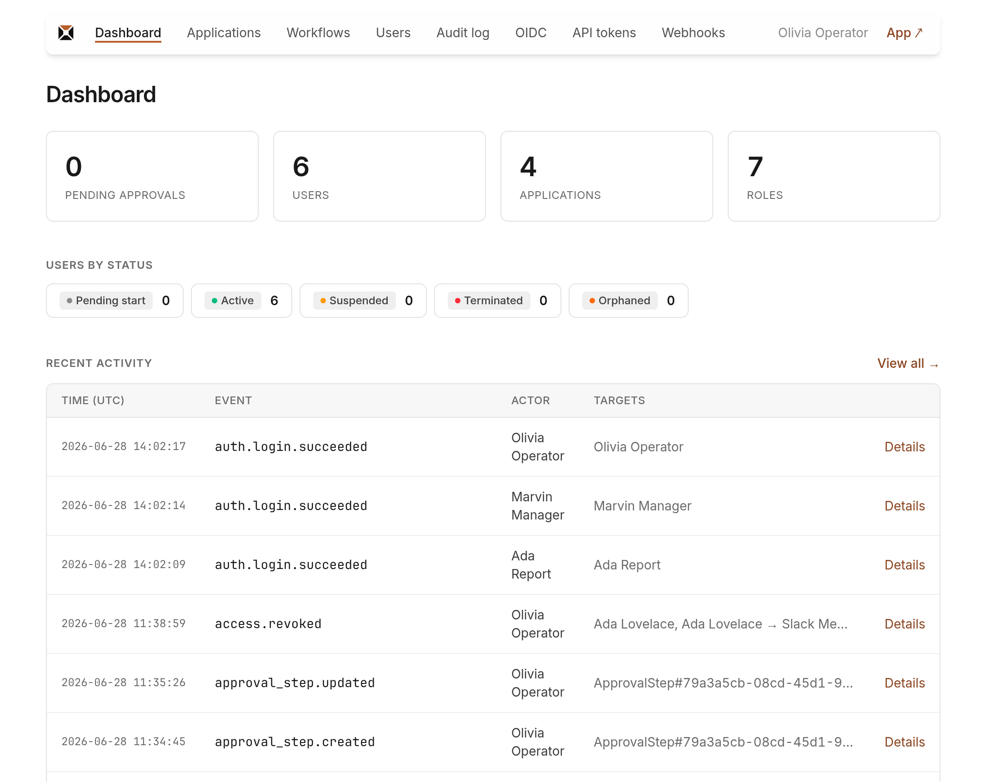
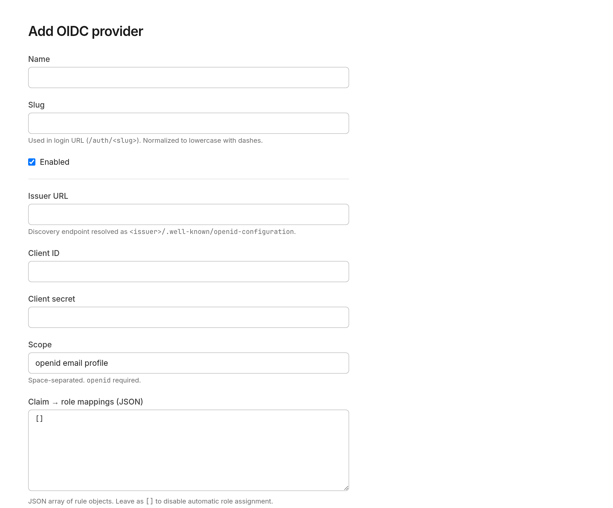
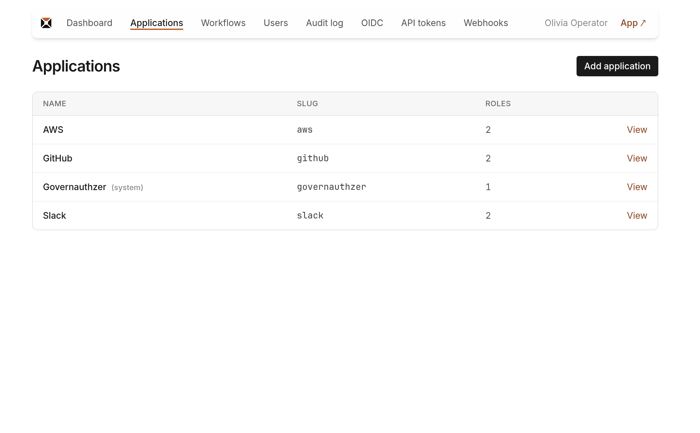
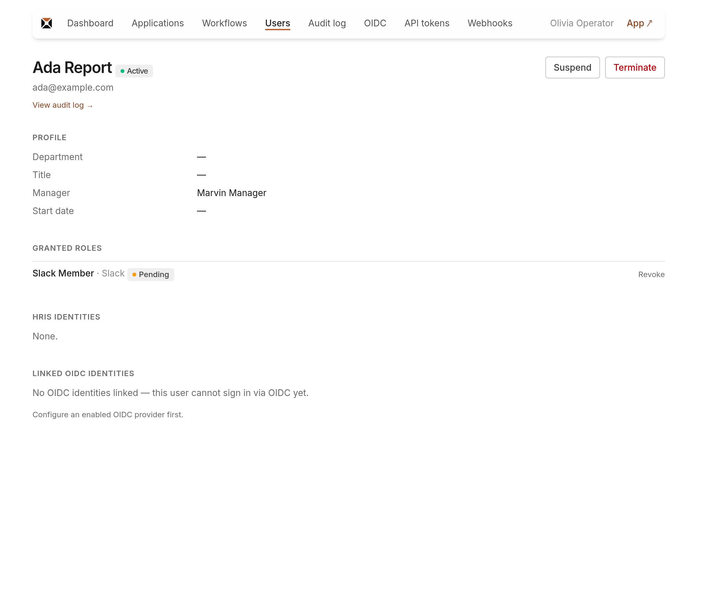

# Admin guide
{: .no_toc }

The operator's surface: set up the catalog, configure login, manage people and access.
{: .fs-6 .fw-300 }

1. TOC
{:toc}

---

The **admin area** (`/admin`) is where an operator runs governauthzer. Everything on the
*policy axis* — applications, roles, approval workflows — plus login configuration, user
management, tokens, webhooks, and the audit log lives here. (The day-to-day
request/approve flow lives in the [end-user UI](how-it-works.md#the-core-loop) at the app
root; operators see an **Admin** link in the top bar.)

## Reaching the admin area

`/admin` is **operator-only**. An *operator* is a user who holds the operator role of the
built-in "Governauthzer" application; everyone else gets a 403.

- **First operator** is created from the shell (`bin/governauthzer seed-admin`) and signs
  in with a one-time `bin/governauthzer emergency-login` URL — see
  [Deployment → Bootstrap](deployment.md#bootstrap-the-first-operator).
- **After that**, once you've configured OIDC and linked your identity (below), operators
  sign in via OIDC like everyone else.

The admin nav: **Dashboard · Applications · Workflows · Users · Audit log · OIDC · API
tokens · Webhooks**, with **App ↗** to jump to the end-user UI.

## First-time setup (recommended order)

1. **[Configure an OIDC provider](#configure-login-oidc-providers)** so people can log in.
2. **[Build your catalog](#build-the-catalog-applications--roles)** — applications, then roles.
3. **[Set up approval](#approval-workflows)** — or rely on the default manager workflow.
4. **[Bring in users and link identities](#users--identities)** — users come from your HRIS;
   link each person's OIDC identity so they can sign in.
5. *(optional)* **[Wire fulfillment](#webhooks)** — a webhook subscription + an API token so
   approved grants reach your target systems.

## Dashboard

The landing page (`/admin`) gives an at-a-glance overview: stat cards (org-wide pending
approvals, users, applications, roles), a **users-by-status** row, and a **recent
activity** feed (the latest audit events). Cards and rows link into the relevant section.

## Configure login (OIDC providers)

**Admin → OIDC.** governauthzer authenticates end users via OIDC; configure one or more
providers here (Okta, Entra ID, Google, Auth0, Keycloak, …).

Fields when adding a provider:

| Field | Notes |
| --- | --- |
| **Name** | Display name (shows on the login button). |
| **Slug** | Used in the login URL `/auth/<slug>`. Lowercase, dash-separated. |
| **Enabled** | Only enabled providers appear on the login page. |
| **Issuer URL** | The OIDC issuer; discovery is fetched from `<issuer>/.well-known/openid-configuration`. |
| **Client ID / Client secret** | From your IdP. The secret is encrypted at rest; on **edit**, leave it blank to keep the stored one. |
| **Scope** | Defaults to `openid email profile`. |
| **Claim mappings** | JSON (reserved for claim→role mapping; safe to leave `[]` at v1). |

The `/login` page renders one button per enabled provider.

{: .important }
> **Login is STRICT.** A person can only sign in once an operator has linked their
> `(provider, subject)` identity (see [Users & identities](#users--identities)). There is
> **no** auto-create on login and **no** email matching — by design. Until you link an
> identity, that user hitting OIDC sees an "identity not registered" page showing the
> `subject` value to copy.

Deleting a provider is refused while linked identities still reference it.

## Build the catalog (Applications & Roles)

**Admin → Applications.**

- **Application** = a target system you govern (Slack, GitHub, AWS, …). Fields: name + slug.
- The built-in **"Governauthzer"** application is **system-managed** (read-only) — its
  operator role is what grants admin access, so it can't be edited or deleted from the UI.

**Roles** live under an application (open an app → add roles). Fields:

| Field | Notes |
| --- | --- |
| **Name / slug** | e.g. "Slack Admin" / `slack-admin`. |
| **Protected** | Protected roles are **not self-requestable** (bootstrap/CLI only) — use for sensitive roles. |
| **Approval workflow** | Which workflow governs requests for this role. Blank = the default manager workflow. |

Deletes are refused while children exist (an application with roles; a role with active
grants) — reassign or revoke first.

## Approval workflows

**Admin → Workflows.** A workflow is a **name + an ordered list of steps**. A role points
at a workflow; a request walks the steps in order.

Each **step** (managed on the workflow's page) has:

- **Strategy** — `manager_of_requester` (route to the requester's manager) or `named_user`
  (a specific approver).
- **Named approver** — required for `named_user`.
- **Fallback approver** — required; used when the primary approver can't be resolved
  (e.g. the requester has no manager).

Notes:

- The **default** workflow can't be deleted — it's the fallback for any role without an
  explicit one. (Seed/bootstrap creates a "manager approves, operator fallback" default.)
- Steps **append** in order; to reorder, delete and re-add (most workflows are 1–2 steps).
- A **deny** at any step ends the request (with a required reason). A **zero-step**
  workflow means the role auto-grants on request — the clean way to express "no approval
  needed."
- A workflow can't be deleted while steps or roles still reference it.

## Users & identities

**Admin → Users.** List (filterable by status); each user's page shows their profile,
granted roles, pending requests, HRIS identities (read-only), and linked OIDC identities.

{: .note }
> Users are **not created here** — they come from your HRIS through the
> [Management API](api.md) (per-record or roster snapshot). The admin UI manages their
> *state* and *identities*, not their creation.

**Status transitions** (only the legal ones are shown):

| Action | Effect |
| --- | --- |
| **Activate** | Move a suspended user back to active. |
| **Suspend** | Freeze login immediately (grants are kept). |
| **Terminate** | **Revokes all access** (cascade) and fires an `access.revoked` per role downstream. Terminal. |

**Link an OIDC identity** (the step that makes login actually work): pick an enabled
provider and paste the user's **subject (`sub`) claim** from the IdP, then *Link identity*.
You can unlink later. Without a linked identity, STRICT login refuses that user.

**Revoke a single grant** directly from the user's page (approved grants only; a pending
request is withdrawn/denied instead). Revoke is audit-logged and fires the downstream
`access.revoked`.

## API tokens

**Admin → API tokens.** Tokens authenticate the [Management API](api.md) (HRIS sync,
reconciliation bridges). Create with:

| Field | Notes |
| --- | --- |
| **Name** | Label for the consumer (e.g. "Workday sync"). |
| **Scope** | `full` (whole management API) or `reconcile` (only the [bridge-facing endpoints](api.md#fulfillment-plane-bridge-facing): reconciliation, grants read, drift reports + `whoami`). |
| **Source** *(optional)* | Locks an HRIS-sync token to a single source (required for roster-snapshot sync). |
| **Expiry** *(optional)* | Leave blank for non-expiring. |

The plaintext token (`gva_…`) is shown **once**, right after creation — copy it then. Only
a SHA-256 digest is stored. Revoke a token anytime (there is no edit; recreate to change).

### Rotating a token

Rotation is create-new-then-revoke-old — zero downtime, no special server support:

1. **Create** a new token with the same scope/source (names like `workday-sync-2026-07`
   keep the audit trail readable).
2. **Swap** it into the consumer's configuration (HRIS agent, bridge).
3. **Verify** the consumer works — `GET /api/v1/whoami` with the new token should return
   its name.
4. **Revoke** the old token.

Between steps 1 and 4 both tokens are valid — that overlap is what makes the swap
seamless; keep it short. Audit events carry `api_token_id` / `api_token_name` in
metadata, so activity from old and new tokens stays distinguishable throughout.

## Webhooks

**Admin → Webhooks.** A subscription delivers signed `access.approved` / `access.revoked`
[CloudEvents](webhooks.md) to a provisioner. Create with:

| Field | Notes |
| --- | --- |
| **Name / Endpoint URL** | Where events POST. |
| **Active** | Toggle delivery on/off. |
| **Event types** | Filter (empty = all published types). |
| **Applications** | Filter (empty = all apps) — routes events to the right consumer. |

The subscription page shows the **signing secret** (both sides need it to verify the HMAC;
**rotate** it there) and a **recent-deliveries** table (status / attempts / last response
code) for observability. The full contract — signing, retries, reconciliation — is in
[Webhooks & CloudEvents](webhooks.md).

## Audit log

**Admin → Audit log.** Read-only — the log is append-only (enforced at the database; see
[Audit-log protection](audit-log-protection.md)). Filter by event type, correlation id,
date range, target, or actor. A detail page shows the actor, the **correlation** (click to
see every event from the same logical operation), **targets** (click to filter to one),
the attribute-changes diff, metadata, and IP / user-agent.

## What operators can't do (by design)

- **No manual grant** — every access goes through an approval workflow (a zero-step
  workflow is the "auto-grant" escape hatch).
- **No user creation in the UI** — users arrive from the HRIS via the API.
- **No editing the built-in app / operator role** — it underpins admin access.
- **No editing or deleting audit events** — the log is append-only.
