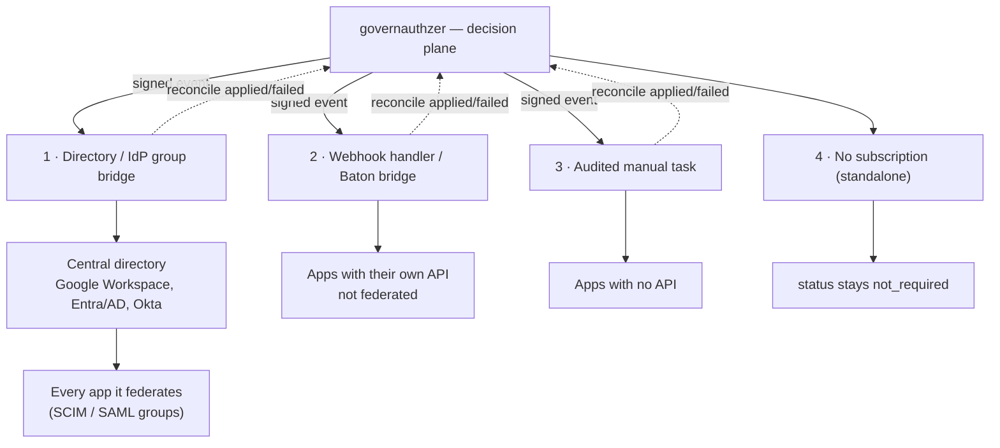

# Fulfillment
{: .no_toc }

How access decisions actually reach your target systems.
{: .fs-6 .fw-300 }

1. TOC
{:toc}

---

governauthzer **decides** who should have access; **fulfillment** is making the target
system match that decision. The core ships the *contract* — signed events out, a
reconciliation callback back — **not the connectors themselves**. That's deliberate: you're
never locked into one vendor's connector catalog, and you pick how each application is
fulfilled.



Every approved grant and every revoke is published as an `access.approved` /
`access.revoked` [CloudEvent](webhooks.md) to each matching webhook subscription. What
consumes it is your choice — and you can mix modes across applications.

## Mode 1 — a directory / IdP group bridge (recommended for federated apps)

Most companies already run a central directory — Google Workspace, Microsoft
Entra / Active Directory, Okta — that provisions downstream SaaS by **group
membership** (SCIM push or SAML group claims). When an app is wired to your
directory that way, you don't need a connector for *that app at all*. You run one
bridge that manages **group membership in the directory**, and the directory fans
the change out to every app it federates.

So you tie a `role` to a directory group; the bridge does one thing — on
`access.approved` add the user to the group, on `access.revoked` remove them. One
integration, to the directory's group API, covers your whole federated estate.

- **Mapping** lives in the bridge config, keyed on `(application.slug, role.slug)`
  → a group (DN / id / email). Convention: name `role.slug` to match the group;
  override for composite roles.
- **One credential, not one per app.** The bridge holds a single directory-admin
  credential; the core still holds none.
- **Reconciliation boundary:** the bridge confirms *"added to group"* and reports
  `applied`. The app's own provisioning (driven by the directory's SCIM) is
  eventually-consistent — the directory's job, not faked here.

Use this for everything your directory federates; fall back to the per-app modes
below only for apps that aren't wired to it.

## Mode 2 — a webhook handler (apps with their own API)

For a target system with an API that **isn't** fulfilled through your directory, run
a small service that receives the signed
CloudEvent and calls that API to add/remove the grant. Two flavors:

- **Your own handler.** A few lines in whatever language you like: verify the HMAC
  signature, branch on `type` (`access.approved` / `access.revoked`), call the target's
  API, return `2xx`. Best when you want full control or the target isn't covered by an
  off-the-shelf connector.
- **A Baton bridge.** Rather than write a connector per system, stand on
  [Baton](https://github.com/conductorone/baton-sdk) — ConductorOne's open-source
  (Apache-2.0) connector framework, which already implements `grant` / `revoke` for many
  SaaS targets. The recommended pattern is a thin bridge that translates governauthzer's
  events into Baton connector calls. (The bridge is a separate component, not bundled in
  core.)

Either way, the handler maps **our** identifiers to the target's:

- *our `user`* → a target account — key your persistent mapping on the immutable
  `user.id`; use `user.email` only for the first match.
- *our `role.slug`* → a target entitlement / group.

That mapping is the connector's job — governauthzer is the system of record for *intent*,
never for target *state*. See [Webhooks → The `data` payload](webhooks.md#the-data-payload).

## Mode 3 — an audited manual task (apps with no API)

Roughly 40% of enterprise apps can't be auto-integrated. Instead of pretending a connector
exists, close the loop honestly: a handler (or a person watching a queue) receives the
event, **does the change by hand**, and reports the outcome back through
[reconciliation](#the-reconciliation-loop). The grant's status moves to `applied` (or
`failed`), visible to operators on the user's page. The audit trail stays complete either
way.

## Mode 4 — standalone (no fulfillment)

governauthzer runs perfectly well with **no** subscription at all — as the record of
*intent* plus the audit trail, while provisioning happens out of band. A grant that
matches no subscription keeps `provisioning_status: not_required`: the core is honest about
not having provisioned an unconnected app, rather than showing a misleading "pending".

## The reconciliation loop

Fulfillment is the consumer's job, so governauthzer never assumes a change took — the
consumer **reports back**:

```
POST /api/v1/applications/:application_id/reconciliations
{ "event_id": "<the CloudEvent id you received>", "status": "applied" }
```

- The grant's `provisioning_status` becomes `applied` / `failed`, surfaced in the admin UI
  on the user's page.
- A grant actively sent to ≥1 subscriber sits at `pending` until a report arrives.
- A *failed revoke* has no access row to flag (the row was destroyed on revoke), so it's
  recorded audit-only today — stale-access alerting is a future addition.

Full request/response shape: [Webhooks → Reconciliation](webhooks.md#reconciliation).

## Drift detection

Events cover changes that flow *through* governauthzer. A change made directly in the
target — someone removes a group member by hand — is **out-of-band drift**, and no event
exists to catch it. The contract closes this with a pull-and-compare loop the consumer
runs on a schedule:

1. **Pull intent**: `GET /api/v1/grants` — the full active-grant list (who should hold
   which role). Core is the source of truth; pull it fresh, never cache it.
2. **List reality** in the target system and diff.
3. **Report findings**: `POST /api/v1/drift-reports` — sent only when drift is found.
   Each sweep lands as one `provisioning.drift_detected` event in the tamper-proof
   audit log.

Drift reporting is **detect + audit only**: core records that reality diverged from
intent, it does not auto-remediate the target. Both endpoints accept the same
`reconcile`-scoped token as reconciliation.

## Two directions, two secrets

| Direction | Mechanism |
| --- | --- |
| **core → consumer** (events out) | **HMAC-SHA256** signature on every delivery (the subscription's `signing_secret`). |
| **consumer → core** (reconcile / grants / drift) | a **`reconcile`-scoped [API token](admin-guide.md#api-tokens)** — limited to the bridge-facing endpoints (reconciliation, grants read, drift reports), nothing else in the management API. |

## Setting it up

1. **Create a webhook subscription** (Admin → Webhooks): endpoint URL, copy the signing
   secret, optionally filter by event type and application. See
   [Admin guide → Webhooks](admin-guide.md#webhooks).
2. **Mint a `reconcile` API token** (Admin → API tokens) for the consumer to report back.
   See [Admin guide → API tokens](admin-guide.md#api-tokens).
3. **Run your consumer** — a directory bridge, a webhook handler / Baton bridge, or a
   manual-task runner. Verify signatures, apply, reconcile.

The full technical contract — envelope, signing, retries, delivery semantics, versioning —
is in **[Webhooks & CloudEvents](webhooks.md)**.

## What governauthzer does *not* do

- Hold your target systems' credentials.
- Claim to know a target's live state (it owns intent, not state).
- Ship the connectors — fulfillment is the open plane, on your side of the line.
