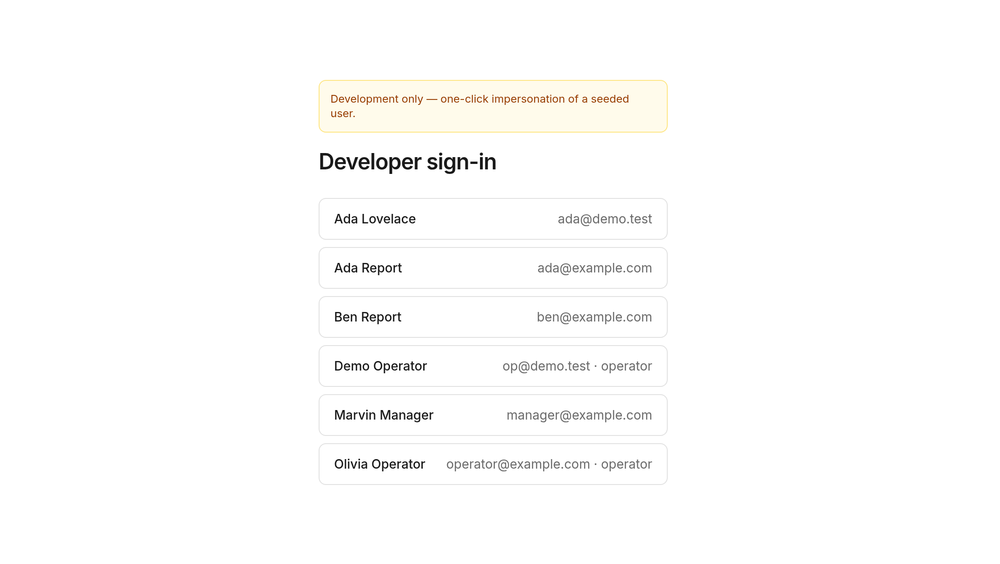
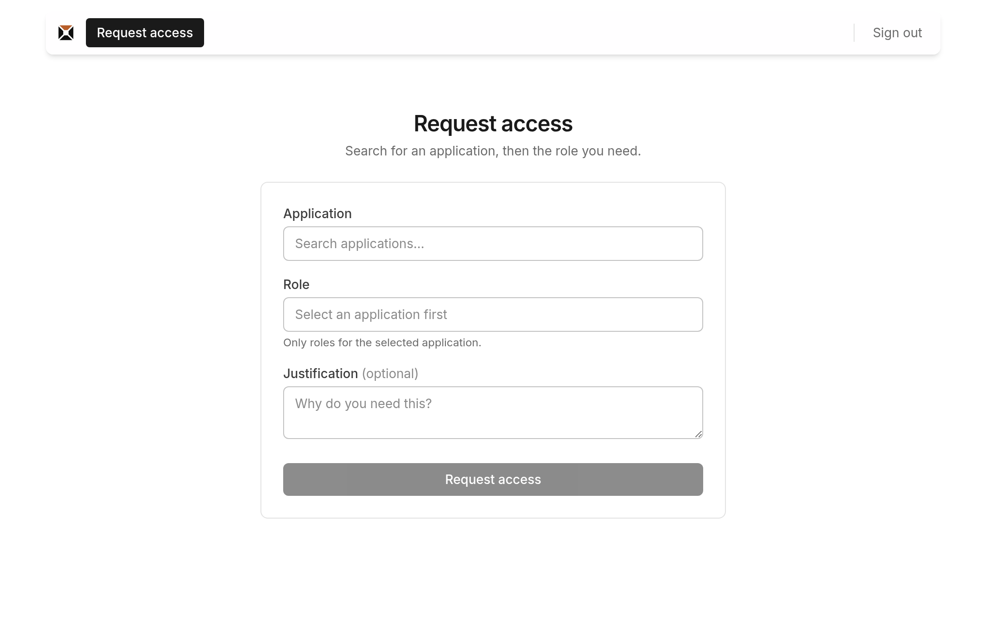
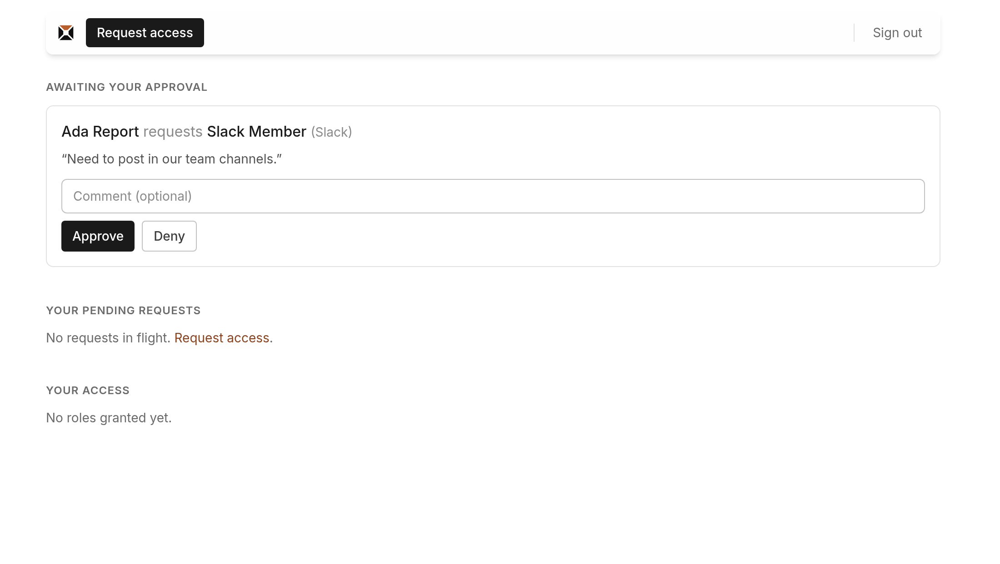
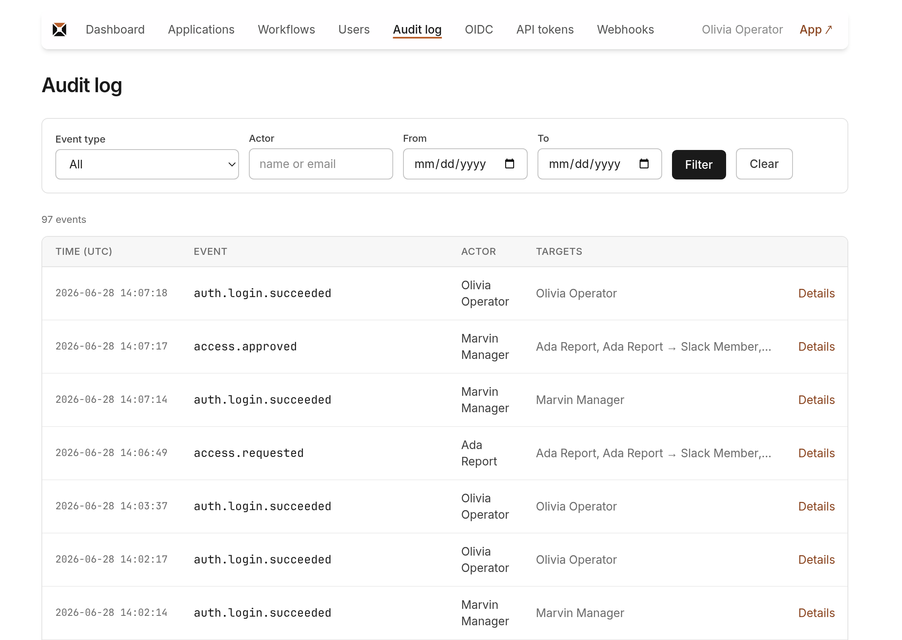

# Getting started
{: .no_toc }

Run it locally and click through the whole request → approve → grant loop in ~10 minutes.
{: .fs-6 .fw-300 }

1. TOC
{:toc}

---

This is the fastest way to *see how it works* (see [How it works](how-it-works.md) for the
concepts). It uses a development-only one-click sign-in and demo data, so you don't need
to wire up OIDC or an HRIS yet. For a real install, see [Deployment](deployment.md).

## Prerequisites

- **Ruby** (see [`.ruby-version`](https://github.com/governauthzer/governauthzer/blob/main/.ruby-version))
- **PostgreSQL** — a throwaway local one in Docker is fine:

  ```sh
  docker run -d --name governauthzer-pg \
    -e POSTGRES_HOST_AUTH_METHOD=trust -p 5432:5432 postgres:16
  ```

## 1. Run it

```sh
bin/setup --skip-server   # install gems + create/prepare the database
bin/rails db:seed         # load demo people, apps, roles, and an approval workflow
bin/dev                   # start the app (Rails + Tailwind watcher)
```

The app is now at **<http://localhost:3000>**.

The seed creates four demo users (all active):

| User | Email | Role in the demo |
| --- | --- | --- |
| Olivia Operator | `operator@example.com` | operator (sees the **Admin** area) |
| Marvin Manager | `manager@example.com` | approver for Ada & Ben |
| Ada Report | `ada@example.com` | an employee who requests access |
| Ben Report | `ben@example.com` | another employee |

…plus requestable apps **Slack / GitHub / AWS** (each with a couple of roles), all wired to
a **Manager approval** workflow.

## 2. Request access (as an employee)

Open **<http://localhost:3000/dev/sign-in>** and click **Ada Report**.



You land on Ada's dashboard. Click **Request access**, choose application **Slack**, role
**Member**, add a justification, and submit. It now appears under **Your pending
requests**.



## 3. Approve it (as the manager)

Go back to **<http://localhost:3000/dev/sign-in>** and click **Marvin Manager** (Ada's
manager, so the request routed to him).

His dashboard shows **Awaiting your approval** with Ada's *Slack Member* request.
Click **Approve**.



That's the loop: sign back in as **Ada** and you'll see *Slack Member* under **Your
access**.

## 4. See the operator side

Sign in as **Olivia Operator** — the top bar now shows an **Admin** link. In the admin
area you can:

- **Applications / Roles / Workflows** — the catalog the requests above were built from.
- **Audit log** — every step you just did is here (`access.requested`, `access.approved`),
  each with actor, target, and timestamp.
- **Webhooks** — create a subscription to receive `access.approved` / `access.revoked`
  events (this is how a real grant reaches Slack — see [Webhooks](webhooks.md)).
- **API tokens** — mint a token for HRIS sync or a reconciliation bridge.
- **Users / OIDC providers** — manage people and configure real login.



## What just happened

You walked the [core loop](how-it-works.md#the-core-loop) end to end: **request →
approve → grant → audit**. In production the same flow runs behind:

- **real OIDC login** instead of the dev sign-in,
- **HRIS-synced users** instead of seed data, and
- the approved grant **firing a signed webhook** to your provisioner, which then reports
  back (reconciliation).

{: .note }
> The `/dev/sign-in` page and `db:seed` demo data are **development-only** — both are hard-
> gated to `Rails.env.development?` and do not exist in production. Production sign-in is
> OIDC, bootstrapped with `bin/governauthzer emergency-login`.

## Next steps

- **Deploy it for real** → [Deployment](deployment.md) (env vars, TLS, encryption keys,
  bootstrap, audit-log protection).
- **Connect your HRIS** → [Management API](api.md) (users + roster snapshot sync).
- **Provision access downstream** → [Webhooks & CloudEvents](webhooks.md) (the outbound
  contract + reconciliation).
