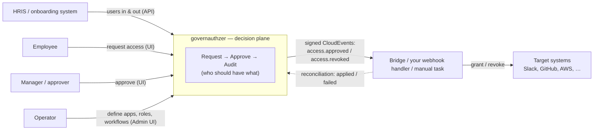
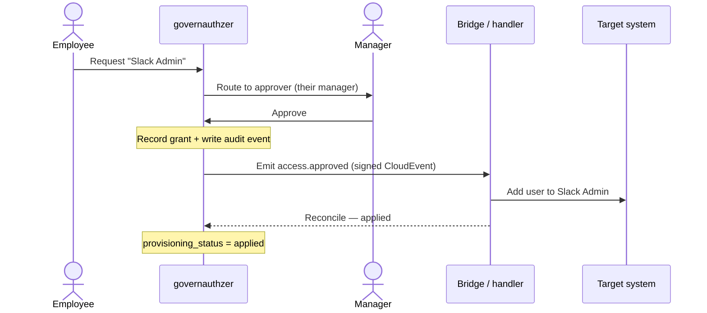

# How it works
{: .no_toc }

The mental model, the objects, and the loop — in plain language.
{: .fs-6 .fw-300 }

1. TOC
{:toc}

---

## The problem it solves

People in your company need access to apps — Slack, GitHub, AWS, an internal tool.
That access should be **requested**, **approved by the right person**, **written to an
audit trail**, and **removed when someone leaves**. Doing this by hand (tickets,
spreadsheets, "ping me on Slack") doesn't scale and doesn't survive an audit.

governauthzer is the system that runs that lifecycle.

## The core idea: decision plane, not provisioner

governauthzer owns the **intent** of access — *who should have which role in which
application, and the approval/audit around it*. It deliberately does **not** own the
target system's **state** (it never holds your Slack admin token and never claims to be
the source of truth for who's actually in Slack right now).

Instead, when a decision changes, it emits an event, and a **fulfillment** layer of your
choosing makes the target system match. A separate **reconciliation** step reports back
whether that worked.

This split is the whole point: the valuable, opinionated part (governance) is the
product; connecting to target systems is an **open plane** you're never locked into.

## The objects you'll work with

| Object | In plain words |
| --- | --- |
| **User** | A person (employee). Synced from your HRIS — never created at login. |
| **Application** | A target system you govern access to (Slack, GitHub, AWS, …). |
| **Role** | A named bundle of access *within one application* (e.g. "Slack Admin"). The unit you request, approve, and audit. |
| **Access** | The fact that a user holds a role (a grant), plus its lifecycle (pending → approved, or revoked). |
| **Approval Workflow** | The rule for who must approve a request for a role. Default: the requester's **manager**, falling back to an operator. |
| **Operator** | An admin who defines the catalog (apps/roles/workflows) and runs the system. Everyone else is a regular user who requests access. |

## The core loop

A request walks from employee to approver to a provisioning event:

1. **Request** — an employee picks a role from the catalog and submits a justification.
2. **Approve** — the request routes to the right approver (their manager by default).
   A denial ends it with a reason; both outcomes are audited.
3. **Grant** — on approval, governauthzer records the access and writes an audit event.
4. **Provision** — it emits a signed `access.approved`
   [CloudEvent](webhooks.md) to any subscribed handler, which applies it to the target.
5. **Reconcile** — the handler reports `applied` / `failed`, and that status shows up on
   the user's page.

You can try this whole loop locally in about ten minutes — see
[Getting started](getting-started.md).

## How people get in — and out

- **In:** your HRIS pushes users through the [Management API](api.md) — per record, or
  (recommended) as a **full-roster snapshot** that the server diffs into
  create/update/terminate. The snapshot makes **silent offboarding** detectable by
  construction: someone quietly dropped from the feed becomes *orphaned*, which freezes
  their access pending resolution.
- **Out:** terminate a user and **every grant is revoked automatically** — each as its
  own `access.revoked` event, so your downstream systems remove them too. Governance
  begins before first login and continues after last login.

## How access actually reaches the target

Fulfillment is the **open plane** — pick per system, mix freely:

1. **Directory / IdP group bridge** — tie a role to a group in your central directory
   (Google Workspace, Entra/AD, Okta) and manage one membership; the directory's own
   SCIM/SAML provisioning fans it out to every app it federates. One bridge covers your
   whole federated estate — no connector per app.
2. **Webhook handler** — for an API'd app *not* fulfilled through your directory, receive
   the signed CloudEvent and call the target's API. Write it yourself (a small service;
   see [Webhooks & CloudEvents](webhooks.md)), or stand on the open-source connector layer
   with a **Baton bridge** instead of rebuilding it.
3. **Audited manual task** — for the apps with no API at all, a human does it and marks it
   done; reconciliation records `applied` / `failed`. No pretending a connector exists.

governauthzer ships the **contract** (signed events + reconciliation), not the connectors
themselves — that's what keeps you un-locked-in.

→ The operator's guide to wiring it up: **[Fulfillment](fulfillment.md)**.

## Where each thing lives

| Concern | Surface | Reference |
| --- | --- | --- |
| Define apps / roles / workflows, link OIDC identities, review the audit log, manage tokens & webhooks | **Admin UI** | (admin guide — coming) |
| Sync users from your HRIS | **Management API** | [api.md](api.md) |
| Provision grants outward + reconcile | **Webhooks / CloudEvents** | [webhooks.md](webhooks.md) |

## What it is *not*

- **Not a provisioner.** It never holds target-system credentials and never claims to know
  the target's live state — that's the bridge's job.
- **Not an identity provider.** It *consumes* OIDC for login; it doesn't issue identities.
  An OIDC login never auto-creates a user, and identities are matched strictly by
  `(provider, subject)` — never by email.
