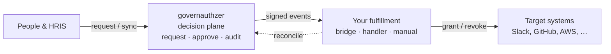

# governauthzer
{: .fs-9 }

Govern access. Bring any provisioner — or use ours.
{: .fs-6 .fw-300 }

[Get started](getting-started.md){: .btn .btn-primary .mr-2 }
[How it works](how-it-works.md){: .btn }

---

## The problem

People in your company need access to apps — Slack, GitHub, AWS, an internal tool. That
access has to be **requested**, **approved by the right person**, **written to an audit
trail**, and **removed when someone leaves**. Tickets, spreadsheets, and "ping me on
Slack" don't scale and don't survive an audit.

## What governauthzer does

governauthzer runs that access lifecycle. It is the **decision plane**: it owns the
*intent* of access — who should have which role in which application, and the
request → approve → audit loop around it. It never holds your target systems' credentials
and never claims to be the source of truth for their live state.

When a decision changes, it emits a **signed event**; a fulfillment layer of your choosing
makes the target system match, then reports back whether it took.

So the governance *is* the product, and connecting to target systems is an **open plane**
you're never locked into — the recommended Baton bridge, your own webhook handler, or
audited manual tasks for the apps that have no API.

→ The full mental model and the request → approve → grant loop: **[How it works](how-it-works.md)**.

## Start here

- **New here?** Read **[How it works](how-it-works.md)**, then
  **[Getting started](getting-started.md)** to run the whole loop locally in ~10 minutes.
- **Operating it?** The **[Admin guide](admin-guide.md)** covers the operator surface.
- **Integrating?** **[Management API](api.md)**, **[Webhooks & CloudEvents](webhooks.md)**,
  and **[Deployment](deployment.md)**.

## What's in these docs

- **[How it works](how-it-works.md)** — the mental model, the objects, and the
  request → approve → grant → provision loop, in plain language (with diagrams).
- **[Getting started](getting-started.md)** — run it locally and click through the core
  loop in ~10 minutes, no OIDC/HRIS wiring needed.
- **[Admin guide](admin-guide.md)** — the operator's surface: configure OIDC login, build
  the catalog (apps/roles/workflows), manage users & identities, tokens, webhooks, audit.
- **[Management API](api.md)** — the HTTP contract your HRIS / onboarding system
  integrates against (identity axis: users + their identities + roster sync).
- **[Webhooks & CloudEvents](webhooks.md)** — the outbound contract a provisioner
  consumes: signed `access.approved` / `access.revoked` CloudEvents, plus the
  reconciliation callback that closes the loop. The published JSON Schemas live
  under [`/schemas`](#published-schemas).
- **[Deployment](deployment.md)** — environment variables, encryption keys, TLS,
  and the Postgres role separation that makes the audit log append-only.

## Published schemas

The `dataschema` URLs carried on every outbound CloudEvent dereference to versioned
JSON Schemas hosted here:

- [`/schemas/access.approved/1.json`](/schemas/access.approved/1.json)
- [`/schemas/access.revoked/1.json`](/schemas/access.revoked/1.json)

See [Webhooks & CloudEvents → Versioning](webhooks.md#versioning) for the evolution
policy.

## Source of truth

The **canonical** management-API contract is the OpenAPI document served by a running
instance at `/api-docs` (rendered) and `/api-docs/v1.yaml` (raw). It is CI-enforced
against the app (`committee-rails`: drift = a failing test), so these pages link to it
rather than duplicate it.
